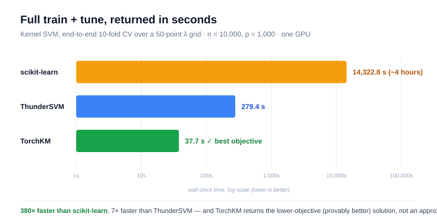

# TorchKM: GPU-accelerated PyTorch-based Library for Kernel Machines


[](https://github.com/YikaiZhang95/torchkm/actions/workflows/tests.yml)
[](https://github.com/YikaiZhang95/torchkm/actions/workflows/docs.yml)

**TorchKM** is a GPU-accelerated PyTorch-based library for **kernel machines** including kernel SVM with a focus on fast and integrated **train + tune** workflows.

**It delivers GPU-native and calibrated classifier for tabular data that your code, or your AI agent, can call, and verify.**

You give it a table of rows and labels. It trains and tunes a kernel model in one call, on your GPU, and hands back a **calibrated probability** for each prediction. The result is the exact and provably optimal solution for the objective you asked for. That makes it what a program (or an LLM agent) can call as a trusted tool.

It uses a **scikit-learn–style API**, for easy integration into existing Python workflows. If you've used `scikit-learn`, the API will feel immediately familiar, just much faster, and built for the GPU.


---

## Install

```bash
pip install torchkm
```

## 30 seconds to a calibrated prediction

```python
from torchkm.estimators import TorchKMSVC

# X: your feature table (n rows x p columns), y: labels in {-1, 1}
clf = TorchKMSVC(kernel="rbf", cv=5, device="cuda", probability=True)
clf.fit(X_train, y_train)          # trains AND tunes (5-fold CV over 50 settings) in one call

clf.predict(X_new)                 # hard labels
clf.predict_proba(X_new)           # calibrated P(class) — a real confidence to threshold on
```

That's the whole loop: `fit` → `predict_proba`. No separate grid search, no manual cross-validation, no second library. Set `device="cpu"` if you don't have a GPU (same code, slower).

## Use it from Claude Code, Codex, Cursor, or any AI agent

Paste this one line into your coding agent and let it wire up the rest:

> **"Install `torchkm` and use `TorchKMSVC` to train a calibrated kernel classifier on my tabular data. Call `fit` to train and tune, then return `predict_proba` for new rows."**

Because the call surface is tiny and the output is a real probability, an agent can use TorchKM as a reliable tool inside a larger workflow: classify a batch, read the confidence, decide what to do next without hallucinating a label.

---

## Why a program — or an AI agent — can trust it

- **Exact, not approximate.** TorchKM returns the provably lowest-objective kernel-SVM solution. Same input → same, well-defined answer. A caller can rely on it.
- **Calibrated probabilities.** `predict_proba` (Platt scaling) gives a genuine confidence in `[0, 1]`, not a raw score — so you can set thresholds, abstain when unsure, or route low-confidence cases to a human.
- **Fast enough to call in a loop.** Full train + tune in tens of seconds on one GPU, where standard tools take minutes to hours (see chart above).
- **GPU-native and light.** Pure PyTorch/CUDA, a handful of dependencies, with a safe CPU fallback. No CUDA build steps, no C++ toolchain.

## Why use TorchKM instead of what you have?

| You're using… | The pain | What TorchKM does |
| --- | --- | --- |
| `scikit-learn` SVM | Tuning means an outer `GridSearchCV` loop that refits from scratch for every setting — minutes to hours. | Folds tuning **into** the algorithm and reuses matrix work across folds and settings. Often 100×+ faster end-to-end. |
| ThunderSVM | Fast SVM fitting, but you still bolt on your own CV loop, and it's SVM-only. | One call trains *and* tunes; also does DWD, logistic, and quantile regression. |
| A neural net for small tabular data | Overkill, finicky to train, poorly calibrated, no guarantees. | A convex model with a single global optimum, calibrated out of the box, strong on small/mid data. |
| Raw scores / uncalibrated models | Your agent or rule engine can't reason about "how sure." | Calibrated probabilities you can threshold and trust. |

On small-to-mid tabular datasets (roughly hundreds to a few hundred thousand rows), well-tuned kernel methods are still some of the most accurate models there are, and they come with a calibrated probability and a convex, reproducible solution. TorchKM makes the *tuning*, usually the slow part, very efficient.

## Where people use it

<details>
<summary><b>Click to expand: example application areas across domains</b></summary>

Anywhere you have a table of rows and want an accurate, **calibrated** yes/no (or a conditional quantile), especially when the dataset is small-to-mid sized and you care that the model is well-tuned and trustworthy:

**Healthcare & life sciences**
- Disease / readmission / adverse-event risk from clinical and lab features, where a *calibrated* probability matters more than a raw score.
- Bioinformatics classification (gene expression, omics, sequence-derived features): a classic stronghold of kernel methods on wide, small-sample data.
- Drug-response and compound-activity (active/inactive) screening.

**Finance & risk**
- Credit default, fraud, and churn scoring where you need a probability to set a decision threshold or expected-loss cutoff.
- Quantile regression for value-at-risk and prediction intervals (`TorchKMKQR`).

**Industry & operations**
- Predictive maintenance: pass/fail and time-to-failure from sensor features.
- Manufacturing QC and anomaly flagging on tabular process data.
- Demand or load quantile forecasting for capacity planning.

**Security & trust**
- Spam, phishing, malware, and intrusion detection on engineered features.
- Bot / abuse classification where calibrated confidence drives auto-block vs. review.

**Marketing & product**
- Lead scoring, propensity-to-buy, conversion and retention prediction.
- A/B segment classification on behavioral features.

**Science & engineering**
- Materials and chemistry property classification on small experimental datasets.
- Remote-sensing / geospatial pixel classification on tabular feature vectors.
- Any lab setting where you have a few hundred to a few thousand measurements and want the most accurate model you can defend.

**AI agents & tooling**
- A **callable classification tool** for LLM agents: hand the agent a fast, calibrated classifier so it stops guessing on structured data and starts *deciding* on a real probability.
- A confidence gate in automated pipelines: act when `predict_proba` is high, escalate to a human when it isn't.
- A cheap, reproducible second opinion to cross-check an LLM's structured-data judgments.

> Scope note: TorchKM does **binary** classification (SVM, DWD, logistic) and kernel **quantile regression** today. For multiclass, wrap it one-vs-rest (a good first contribution — see below). It shines on small-to-mid tabular data; for millions of rows, use the built-in Nyström mode (`low_rank=True`).

**The same three lines, on different jobs.** Ask in plain language, get a fast calibrated probability back:

| Finance — fraud | Healthcare — readmission |
| --- | --- |
|  |  |
| **Security — phishing** | **Industry — predictive maintenance** |
|  |  |
| **Marketing — churn** | |
|  | |

</details>

---

## What's inside

scikit-learn-style estimators: same `fit` / `predict` / `predict_proba` interface across all of them:

| Estimator | Task |
| --- | --- |
| `TorchKMSVC` | kernel SVM classifier |
| `TorchKMDWD` | kernel distance-weighted discrimination classifier |
| `TorchKMLogit` | kernel logistic regression |
| `TorchKMKQR` | kernel quantile regression |

Common methods: `fit(X, y)`, `predict(X)`, `decision_function(X)`, `predict_proba(X)` (when `probability=True`), `platt_plot(X, y)`.

Kernels: `rbf` (default) and `poly`. Utilities: `rbf_kernel`, `kernelMult`, `sigest`, `standardize`, `data_gen`.

Key benefits, in one place:

- **Integrated train + tune** — pathwise solutions over a grid of regularization values (`Cs`) with cross-validation built in, not bolted on.
- **Exact cross-validation** for kernel machines (including exact LOOCV for kernel SVM).
- **GPU acceleration** via PyTorch/CUDA, with safe CPU fallback.
- **Nyström low-rank mode** (`low_rank=True`) for large datasets.
- **Calibrated probabilities** via Platt scaling.

## How it's so fast

In a normal workflow the slow part isn't fitting one model. It's refitting the model for every cross-validation fold and every tuning value. TorchKM avoids that: it reuses one kernel computation across all folds and settings (an exact cross-validation formula plus a single eigendecomposition reused along the regularization path). You still get the **exact** solution, without paying for it 500 times.



The result, from the paper's benchmarks (one GPU, full train + tune, 10-fold CV over 50 settings):

| Dataset | scikit-learn | ThunderSVM | **TorchKM** |
| --- | --- | --- | --- |
| n=10,000, p=1,000 | 14,322.8 s (~4 h) | 279.4 s | **37.7 s** |
| n=20,000, p=1,000 | did not finish in 8 h | 580.8 s | **129.3 s** |

In every case TorchKM also reached the **best (lowest) objective**, i.e. a provably better solution, not just a faster one.

---

## More examples

### Larger datasets — Nyström low-rank mode

```python
clf = TorchKMSVC(
    kernel="rbf",
    low_rank=True, num_landmarks=40, nys_k=20,
    cv=5, device="cuda", probability=True,
)
clf.fit(X_train, y_train)
```

You can also enable it at fit time: `clf.fit(X, y, low_rank=True, num_landmarks=40, nys_k=20)`.

### Kernel quantile regression

```python
from torchkm.estimators import TorchKMKQR

qr = TorchKMKQR(kernel="rbf", cv=3, tau=0.5, device="cuda")  # tau = the quantile
qr.fit(X_train, y_train)
qr.predict(X_new)
```

Use `TorchKMKQR(low_rank=True)` for the Nyström approximation on large data. (There is no separate `TorchKMNysKQR` class.)

### Probabilities

Set `probability=True` to enable Platt scaling and `predict_proba`. `platt_plot(X, y)` visualizes the calibration.

### Device

```python
import torch
device = "cuda" if torch.cuda.is_available() else "cpu"
```

TorchKM runs on GPU when CUDA is available and falls back safely to CPU otherwise.

---

## Documentation

Full docs, API reference, tutorials, and benchmark-reproduction notes:
**https://yikaizhang95.github.io/torchkm/**

## Development install

```bash
git clone https://github.com/YikaiZhang95/torchkm.git
cd torchkm
pip install -e ".[dev,examples,viz]"
python -m pytest -q
```

## Testing and coverage

```bash
python -m pytest -q
```

CI runs the CPU-safe suite across Python 3.10, 3.11, and 3.12, and enforces a minimum 90% coverage on 3.11. The most recent CUDA validation reports **214 tests passed and 98% coverage** on an NVIDIA L40S. CUDA smoke tests (`pytest.mark.cuda`) skip automatically when CUDA is unavailable; run them with `python -m pytest -q -m cuda`.

## Contributing

Issues, bug reports, benchmarks, docs, and pull requests are welcome — see [CONTRIBUTING.md](CONTRIBUTING.md).

Good first contributions:
- additional kernels
- a multiclass (one-vs-rest) wrapper
- more benchmark scripts
- expanded examples and tutorials

## Citation

If you use TorchKM in academic work, please cite:

```bibtex
@article{zhang2026torchkm,
  title   = {TorchKM: GPU-Accelerated Kernel Machines with Fast Model Selection in PyTorch},
  author  = {Zhang, Yikai and Jia, Gaoxiang and Ding, Jie and Wang, Boxiang},
  year    = {2026},
  url    = {https://arxiv.org/pdf/2606.06742}
}
```

## License

MIT License. See `LICENSE`.

## Contact

Yikai Zhang — skyezhang1995@gmail.com
